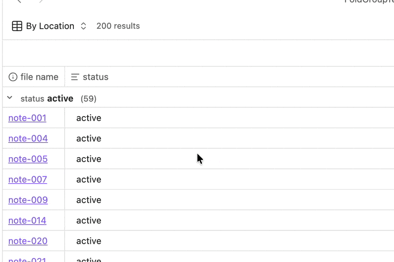

# Group Enhancer for Bases

Group Enhancer for Bases adds extra functionality to grouped views in [Obsidian Bases](https://obsidian.md/bases).



## Features

- Collapse and expand grouped sections
- Collapse all / Expand all actions
- Optional toolbar for grouped views
- Optional record counts beside group names
- Remembered collapse state between sessions

## Installation with BRAT

1. Install **BRAT** from Obsidian Community Plugins.
2. Open **Settings → BRAT → Add Beta Plugin**.
3. Add this repository:
   ```
   https://github.com/TfTHacker/group-enhancer-for-bases
   ```
4. Enable **Group Enhancer for Bases** in **Settings → Community Plugins**.


## Notes

- This plugin is intended for grouped Bases views.
- Behavior is controlled through global plugin settings.

## Origin

This plugin was originally inspired by the Obsidian forum feature request:
- [Add ability to fold groups in Bases views](https://forum.obsidian.md/t/add-ability-to-fold-groups-in-bases-views/106822)

## Releasing

This plugin publishes Obsidian-compatible release assets from a Git tag.

Use this exact flow for a new release:

1. Make sure the working tree is clean:
   `git status`
2. Bump the version:
   `npm version patch`
   or `npm version minor`
   or `npm version major`
3. Push the release commit:
   `git push origin main`
4. Push the tag created by `npm version`:
   `git push origin --tags`
5. GitHub Actions will build the plugin and create a GitHub Release containing:
   - `manifest.json`
   - `main.js`
   - `styles.css`

Notes:

- The Git tag must match the plugin version in `manifest.json` exactly, using Obsidian's required `x.y.z` format.
- Do not use a `v` prefix. Use `0.1.2`, not `v0.1.2`.
- This repository configures `npm version ...` to create plain `X.Y.Z` tags automatically.
- `npm version ...` updates `package.json`, `package-lock.json`, and creates the tag.
- The project's `version` script also updates `manifest.json` and `versions.json` automatically.
- The release workflow lives in `.github/workflows/release.yml`.

## License

MIT — see [LICENSE](LICENSE).
